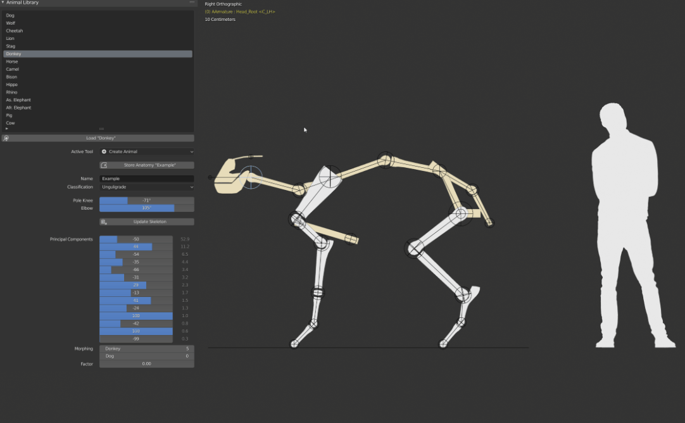

# Morphological Animal Design App: Parameterized Quadrupedal Anatomy and Locomotion
<div align="center">
    
    
</div>

A small project of the [Computational Robotics Lab](http://crl.ethz.ch/) at ETH Zurich

## Table of Contents
* [About the Project](#about-the-project)
* [Getting Started](#getting-started)
  * [Blender](#blender)
  * [Base Application](#base-application)
  * [Install Dependencies](#install-dependencies)
  * [Install Add-on](#install-add-on)
* [Usage](#usage)
  * [How to Create an Animal](#how-to-create-an-animal)
    * [Load an Existing Animal](#load-an-existing-animal)
    * [Interactive Modeling](#interactive-modeling)
    * [Morphing](#morphing)
    * [Store an Animal](#store-an-animal)
  * [Run the Principle Component Analysis](#run-the-principle-component-analysis)
  * [Create the Walk Animation](#create-the-walk-animation)
    * [Reference Animal](#reference-animal)
    * [Store the Parameters](#store-the-parameters)
  * [Quick Blender Tips and Tricks](#quick-blender-tips-and-tricks)
    
## About The Project 
This project provides a tool inside the 3D software [Blender](https://www.blender.org/), to quickly prototype quadrupedal anatomies and their respective walk motion. 
The repository contains the source code for the Blender add-on and the Blender file with the animation skeleton. Please follow the instructions below to get started and how to use the tool.
Read the [report](https://gitlab.inf.ethz.ch/scoros/animate/-/blob/master/report.pdf) for detailed information and design decisions. 

We present a general animation skeleton parameterized by the location and size of its joints (in red below):
<div align="left">
    
</div>

Furthermore, we present a parameterization of the walk locomotion relative to the configuration of the animation skeleton. A visually viable walk motion is constructed from an existing reference motion assuming dynamic similarity.

<div align="left">
    
</div>

`(a) African Elephant`, `(b) Horse`, `(c) Stag`, `(d) Lion`, `(e) Cheetah`, `(f) Wolf`

## Getting Started
### Blender
The application runs inside the open-source 3D software Blender. 

- Download Blender [here](https://www.blender.org/download/) 

_Blender 2.82 or higher is required_

### Base Application
- Download the `BaseApplication.blend` file. 

The file contains the animation skeleton and a Blender environment setup for the application. 

### Install Dependencies
Blender runs inside its own python environment. To install the external dependencies, a script is ready inside `BaseApplication.blend`.
- Open `BaseApplication.blend`
- Switch to `InstallDependencies` tab (top of screen)
- Press `Run script` (top right corner of screen)

Try to run Blender as administrator should the script fail. 

### Install Add-on
- Download `morph_animal` and zip the folder
- Open `BaseApplication.blend`
- Navigate to `Edit -> Preferences -> Add-ons`
- Click `Install...` and select `morph_animal.zip`
- Enable the installed `Morphological Design Animal App`


## Usage

### How To Create An Animal
<div align="center">
    
</div>

#### Load An Existing Animal
There are 15 predefined animals. Select one from the `Animal Library` and press `Load "NameOfSelected"`.

#### Interactive Modeling
- Use Blender's 3D View to move and scale the joints manually. [Quick Blender Tips and Tricks](#quick-blender-tips-and-tricks)
- Update the underlying animation rig by pressing `Update Skeleton`. 
- Adjust `Pole Knee/Elbow` to fix the orientation of the limbs
- Classify the animal as `Unguligrade` or `Digitigrade`

_Create a pose that is consistent among all animals. Typically, the MTP joint (between the toe tip and ankle) lies directly under the hip joint._
#### Morphing
Requires that the `Principle Component Analysis` has been done.
- Adjust the weights of the `Principle Components` to create a new animal
- OR morph between two entries from the `Animal Library`.

#### Store An Animal
- Enter a `Name` for your configuration
- Press `Store Anatomy "TheNameYouGave"` to add the configuration to the `Animal Library`
- Save the Blender file

### Run The Principle Component Analysis
The `Principle Component Analysis` ([PCA](https://en.wikipedia.org/wiki/Principal_component_analysis)) calculates a low dimensional vector representation of the skeleton configuration based on the entries in the `Animal Library`. This unlocks [morphing](#morphing) and is used to internally compare two configurations. It must be recalculated every time the application is started:

- Activate the `Create Animal` tool
- Press `Perform PCA - Initialize` 
### Create The Walk Animation
<div align="center">
    
</div>

The walk animation is generated by switching to `Tweak Gait`. Press `Play` to start the animation.

#### Reference Animal
The values of the walk parameters are determined based on the stored parameters of a reference animal. Default reference is the `Horse`. When the `Principle Component Analysis` has been performed, two configurations are compared based on the squared distance of their weight vector. Among all animals that have stored walk parameters, the one with minimal distance is chosen as reference.  

The application comes with walk parameters stored for `Wolf`, `Cheetah`, `Lion`, `Horse`, `Rhinoceros` and `African Elephant`.

#### Store The Parameters
- You can interactively tweak the parameters. For further information, a tooltip appears when hovering over any parameter field.  
- Press `Save Gait "NameOfAnimal"`. 
- Save the Blender file

_You can only store the walk parameters for entries in the `Animal Library`_
### Quick Blender Tips And Tricks
- Mutate selected joint
    ``` 
    Left Click - Select
    G - Move
    S - Scale
    ``` 
- Change Viewport
    ```
    Numpad 1 - Front View
    Numpad 3 - Right View (Default)
    Numpad 7 - Top View
    Numpad 5 - Toggle Perspective / Orthographic View

    Scroll - Zoom in and out
    Hold Middle Mouse - Rotate in 3D 
    Shift + Hold Middle Mouse - Move Viewport

    Useful on laptop: Enable Edit -> Preferences -> Input -> Emulate Numpad
    ```
- Tool disappeared?
    ``` 
    T - Toogle sidebar
    ```

- The virtual armature must be selected and in 'Pose Mode' otherwise the tool disappears. To fix this:
    ``` 
    Select the virtual armature
    Hold Tab and select 'Pose Mode' from the pie menu.
    ```
